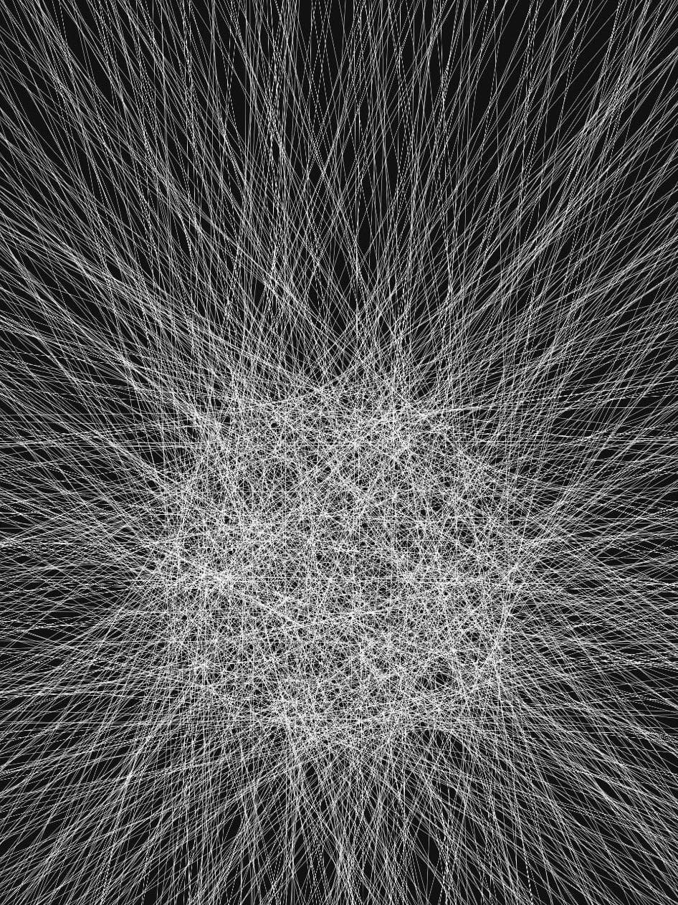

This is a collection of all my generative art.

### Usage

```bash
npm install canvas-sketch-cli -g

canvas-sketch sketch.js --open
```

### Gallery

*The following files have been scaled/optimized for the web.*

#### Orb



#### The Mothership


#### Flower


#### Blossom


#### Savannah


#### Lissajous Curve


#### Strange Attractors

###### Lorenz Attractor


###### De Jong Attractor


###### Spirographs


### License

© 2019 Sivasubramanyam A. All rights reserved.
